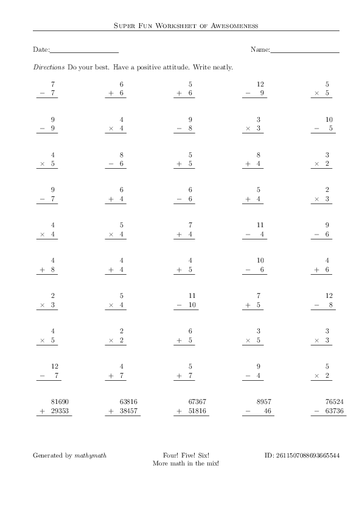
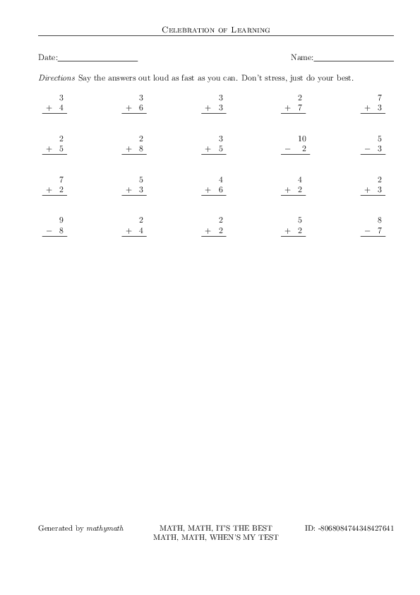

# mathymath
Elementary school math worksheet generator

`mathymath` is a simple math worksheet generator tool.  There are likely
many others available but I wanted one I could easily customize and that
fit easily into my preferred workflow.

The basic flow is the program `mathymath` reads a LaTeX file that has an
empty worksheet and it generates a LaTeX file that is filled with problems.
The bulk of the formatting is handled in the LaTeX input file.  The `mathymath`
program has various options for specifying how many problems of different types,
limits on numbers involved, etc.

# Sample Worksheet


# Sample Quiz/Test



# Usage
## Help Output
To obtain a full list of `mathymath` options, use
`./mathymath --help`

## Basic Usage
The simplest use is
```
./mathymath
latex mathymath_out.tex
latex mathymath_out.tex
dvipdf mathymath_out.dvi
```

## More Complex Usage
In the following example, we will generate a worksheet with 50 questions.  There
will be 15 addition problems, 15 subtraction problems, 3 bonus addition problems
involving multi-digit addition, 2 bonus subtraction problems involving multi-digit
subtraction, and 15 multiplication problems.

```
./mathymath \
    --min_num 4 \
    --max_num 12 \
    --num_add 15 \
    --num_sub 15 \
    --num_addx 3 \
    --num_subx 2 \
    --min_mul 2 \
    --max_mul 5 \
    --num_mul 15 \
    --num_div 0 \
    --latex_columns 5 \
    $*

latex mathymath_out.tex
latex "${out}.tex"
dvipdf mathymath_out.dvi worksheet.pdf
```

# Contributing
Contributions are welcome.  A partial list of desired improvements are:
- Read the name of the `latex` (possibly `pdflatex`) and `dvipdf` programs
from a config file with suitable defaults.
- Include options to automatically generate postscript/PDF output without
requiring the manual steps of running LaTeX.
- Include options for generating a worksheet and sending to the printer in
a single step.
- More quotes that are suitable for elementary aged kids.  These should be
short and funny.  Inappropriate quotes will not be accepted but this is
free software so you are of course always welcome to create your own fork.
- Submissions should be made by creating a fork on github and then submitting
a pull request.


